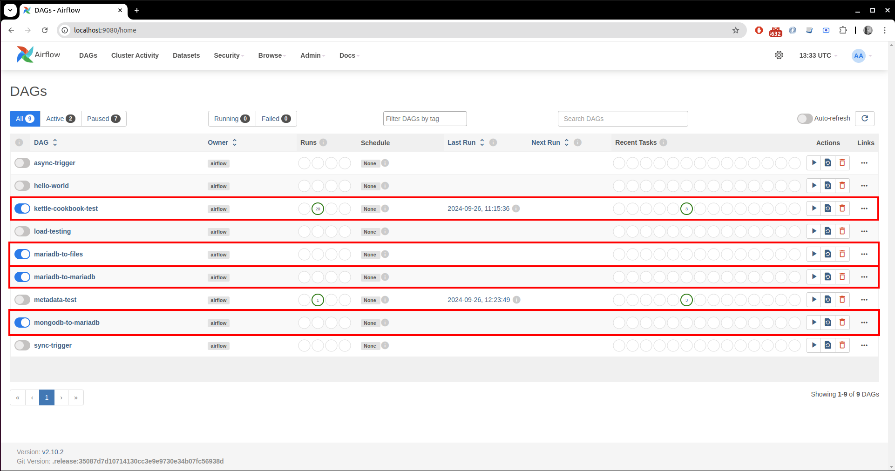

# Description

Step by step approach to easily dockerize Airflow, Pentaho Data Integration and Datahub.
Below is the high level architecture of the setup:
- Airflow:
    - Orchestrator container
    - Sends transformation/job metadata as task to Pentaho container
    - Process metadata information on DAGs and sends is to Datahub to record datasets, datasources, processes and corresponding lineage. 

- Pentaho:
    - Container receives transformation/job details as task to be done
    - Performs (runs) the actual task (transformation/job)

- Datahub
    - Container receives metadata information that gets stored as Datasets, Processes or Data-sources taking into consideration its relationship to show corresponding lineage. 


# Pre-requisites
- [Docker Engine](https://docs.docker.com/engine/install/)
- [Docker Compose](https://docs.docker.com/compose/install/)

# Versions
- Airflow 2.10.2
- PDI 9.4.0.0-343
- Datahub v0.14.0.2

 # Setup
Change directory to the project folder before performing below steps.

### Environment variables, files & folders for containers
- Create a .env file and add the user and group Ids for the respective containers.
This is required for the containers to have same access privileges as that of the host user during docker compose.

        echo -e "PENTAHO_UID=$(id -u)\nPENTAHO_GID=0\nAIRFLOW_UID=$(id -u)\nAIRFLOW_GID=0" > .env

- If needed, append the below optional variables to the above .env file.

        echo -e "<variable name>=<value>" >> .env
    - HOST_ENV --> run containers as localhost/dev/qa/prod. This will copy corresponding kettle.properties into the PDI container. Also enables PDI transformations to pick environment specific DB JNDI connections during execution. Can be used by Airflow to connect to corresponding resources.
    - CARTE_USER --> Default: cluster
    - CARTE_PASSWORD --> Default: cluster
    - AIRFLOW_ADMIN_USER --> Create Web UI user. Default: airflow
    - AIRFLOW_ADMIN_PASSWORD --> Default: airflow
    - AIRFLOW_ADMIN_EMAIL --> Required if new user to be created
    - PENTAHO_DI_JAVA_OPTIONS --> Allocate JVM memory to PDI container, based on host machine RAM. Increase if container crashes due to GC Out of memory. Ex: for Min. 1G and Max 4G, set this to "-Xms1g -Xmx4g"
    - CARTE_HOST_PORT --> Default: 8181
    - AIRFLOW_HOST_PORT --> Default: 9080

 - Create below folders for the container volumes to bind

        mkdir ./setup-airflow/logs ./setup-airflow/plugins ./setup-pentaho/logs


- Source Code
Since the DAGs/PDI source code files might undergo frequent updates, they are not copied into the container during image build, instead mounted via docker compose. Any update to these source code files on host will automatically get visible inside the container.

  - Airflow:
    - Default folder for DAGs on host is ./source-code/dags
    - Replace the above default folder in the docker compose file, with the desired folder location on host.
    - Place all the DAG files in the above host dags folder.
    - Default content of the connections table, after Airflow schema has been initialised is populated by using the script: ./setup-airflow/datahub-connection-row.sql, executed co-dependencies between init containers. 

  - Pentaho:
    - Default folder for ktr/kjb files on host is ./source-code/ktrs
      - ./source-code/ktrs/metadata-injection-example hosts the main 3 use-cases for tests.
      - ./ource-code/ktrs/kettle-cookbook hosts a kettle job that is able to generate auto documentation about the provided args pointing to desired Kettle jobs/transformations. 
    - Replace the above default folder in the docker compose file, with the desired folder location on host.
    - Place all the PDI files in the above host ktrs folder.
    - Update repositories.xml file accordingly, to make them visible to Carte.

  - MongoDB:
    - Init script in order to initialise the database with a given database, collection and data on such collection, meant for tests
    is in ./setup-mongodb/mongo-init.js
    
  - MariaDB:
    -  Init script in order to initialise the database with a given database, tables and data on such tables, meant for tests
    is in ./setup-mariadb/init.sql

### Build & Deploy
Below command will build (if first time) and start all the services.

        docker compose up -d

# Web UI
- If not localhost, replace with server endpoint Url
- If not below default ports, replace with the ones used during CARTE_HOST_PORT & AIRFLOW_HOST_PORT setup.

# Airflow Webserver

        http://localhost:9080/home
        user:airflow
        password:airflow

# Carte Webserver

        http://localhost:8181/kettle/status
        user:cluster
        password:cluster

# Datahub

        http://localhost:9002
        user: datahub
        password: datahub

# Provided DAGs as invokers of PDI test transformations (use-cases)



- mariadb-to-files (source-code/dags/mariadb-files-transformation.py): calls the metadata-injection-example/transformations/mariadb_to_file.ktr transformation and logs to Datahub.
- mariadb-to-mariadb (source-code/dags/mariadb-mariadb-transformation.py): calls the metadata-injection-example/transformations/mariadb_to_file.ktr transformation and logs to Datahub.
- mongodb-to-mariadb (source-code/dags/mongodb-mariadb-transformation.py): calls the metadata-injection-example/transformations/mariadb_to_file.ktr transformation and logs to Datahub.
- kettle-cookbook-test (source-code/dags/kettle-cookbook.py): calls the kettle-cookbook/pdi/documet-folder.kjb job.

# Kettles (transformations/jobs) provided
- mariadb_to_file (metadata-injection-example/transformations/mariadb_to_file.ktr): performs a full read of the nations.region_areas table, applies a string modification over the "name" column replacing Europe with EU, and outputs the data into an avro file and a csv file (same data).
- mariadb_to_mariadb (source-code/ktrs/metadata-injection-example/transformations/mariadb_to_mariadb.ktr): performs a full read of the natios.region_areas table, applies a string modification over the "name" column replacing Europe with EU, and inserts/update the data into the nations_region_areas_modified.
- mongodb_to_mariadb (source-code/ktrs/metadata-injection-example/transformations/mongodb_to_mariadb.ktr): performs a full read of the cinfodata.cities collection, performing a transformations over the JSON path city.name replacing MA with MASSACHUSSETTS, then inserts/updates the data into nations.cities_modified on MariaDB database.
- document-folder.kjb (source-code/ktrs/kettle-cookbook/pdi/document-folder.kjb): accepts the input_folder to document ad an output folder where to place the result of the auto-documentation process. It scans given input path searching for Kettle transformations/jobs and process them parsing its details in order to build a web page showing corresponnding ifnormation in a friendly and readable way. 

# How to code a DAG to trigger PDI transformations/jobs

As per [Carte REST API documentaion](https://help.pentaho.com/Documentation/9.1/Developer_center/REST_API_Reference/Carte), executeJob and executeTrans APIs can be used to trigger tasks remotely.

## Method 1:
Job trigger:

        job = BashOperator(
                task_id='Trigger_Job',
                bash_command='curl "${PDI_CONN_STR}/kettle/executeJob/?rep=test-repo&job=/helloworld/helloworld-job"'
        )

Transformation trigger:

        trans = BashOperator(
                task_id='Trigger_Transformation',
                bash_command='curl "${PDI_CONN_STR}/kettle/executeTrans/?rep=test-repo&trans=/helloworld/helloworld-trans"'
        )

- Parameters can be added to curl command by adding &, ex: &param1=value1&param2=value2

- PDI_CONN_STR: this is an environment variable in compose file, set to the PDI docker container URL. Used by Airflow DAG to send tasks to Carte. Below URL has ```pdi-master``` as the container name (used in compose file) with Carte running in it.

        http://${CARTE_USER:-cluster}:${CARTE_PASSWORD:-cluster}@pdi-master:${CARTE_HOST_PORT:-8181}


## Method 2
In DAG file, import the user defined helper functions defined in ```utils/execute_pdi.py```.
Unlike method 1, this makes use of ```execute-carte.sh``` file which not only keeps checking Carte task status but also gets actual task log (for jobs only) generated by Carte, into Airflow log.

Job trigger:

        job = BashOperator(
                task_id='Trigger_Job',
                bash_command=execute_job(
                rep="test-repo",
                task="helloworld-job",
                dir="/helloworld/",
                param=""
                )
        )

Transformation trigger:

        trans = BashOperator(
                task_id='Trigger_Transformation',
                bash_command=execute_trans(
                rep="test-repo",
                task="helloworld-trans",
                dir="/helloworld/",
                param=""
                )
        )
# Best practices
- ```jdbc.properties``` file, which contains database access credentials, has been included in this repo for reference purpose only. In actual development, this should be avoided and needs to be added to gitignore instead. After first code pull to a server, update it with all JNDI details before docker compose.

- ```.env``` file also may contain sensitive information, like environment dependent access keys. This also should be added to .gitignore file. Instead create this file with necessary parameters during image build.

- ```HOST_ENV``` setting this parameter gives us a flexibility to choose appropriate ```kettle.properties``` file. For example, QA and PROD mailing server SMTP details may differ. This can be included in separate kettle properties file, to be selected dynamically based on the host environment. Not only this, if one uses the ```jdbc.properties``` file, we can enable PDI container dynamically select the correct JNDI from ```jdbc.properties``` file. For ex: if one needs to test a transformation in QA environemnt using Postgres JNDI connection encoded as ```db-${HOST_ENV}```, running PDI service with ```HOST_ENV=qa```, will render ```db-qa``` database JNDI, thus using QA data for testing.

- ```PENTAHO_DI_JAVA_OPTIONS``` Having this option lets the user tweak the amount of memory PDI gets inside the container, to run a task. Depending on the host machine memory and average task complexity, this can be modified to avoid PDI container crash due to "GC Out of Memory" errors. If host machine has ample RAM and PDI container is crashing due to the default memory limits, we can increase it by setting ```PENTAHO_DI_JAVA_OPTIONS=-Xms2g -Xmx4g``` 2GB and 4GB being the lower and upper limits respectively.

# Datahub

- [Reference to docker-compose.yaml file](https://raw.githubusercontent.com/datahub-project/datahub/master/docker/quickstart/docker-compose-without-neo4j-m1.quickstart.yml)

- [Official docs for docker deployment](https://datahubproject.io/docs/quickstart)


# References & Credits
- [What is Carte Server ?](https://wiki.pentaho.com/display/EAI/Carte+User+Documentation)

- [Kettle Rest API Documentation](https://docs.hitachivantara.com/v/u/en-us/pentaho-data-integration-and-analytics/10.0.x/mk-95pdia010)

- [Configure Carte Server](https://help.pentaho.com/Documentation/8.0/Products/Data_Integration/Carte_Clusters/060)

- [Set Repository on the Carte Server](https://help.pentaho.com/Documentation/9.1/Products/Use_Carte_Clusters)

- [Carte APIs to trigger kettle transformation/jobs](https://help.pentaho.com/Documentation/9.1/Developer_center/REST_API_Reference/Carte)

- [Monitoring Carte logs from Airlfow container](https://diethardsteiner.github.io/pdi/2020/04/01/Scheduling-a-PDI-Job-on-Apache-Airflow.html)

- [Docker entrypoint logic](https://github.com/aloysius-lim/docker-pentaho-di/blob/master/docker/Dockerfile)